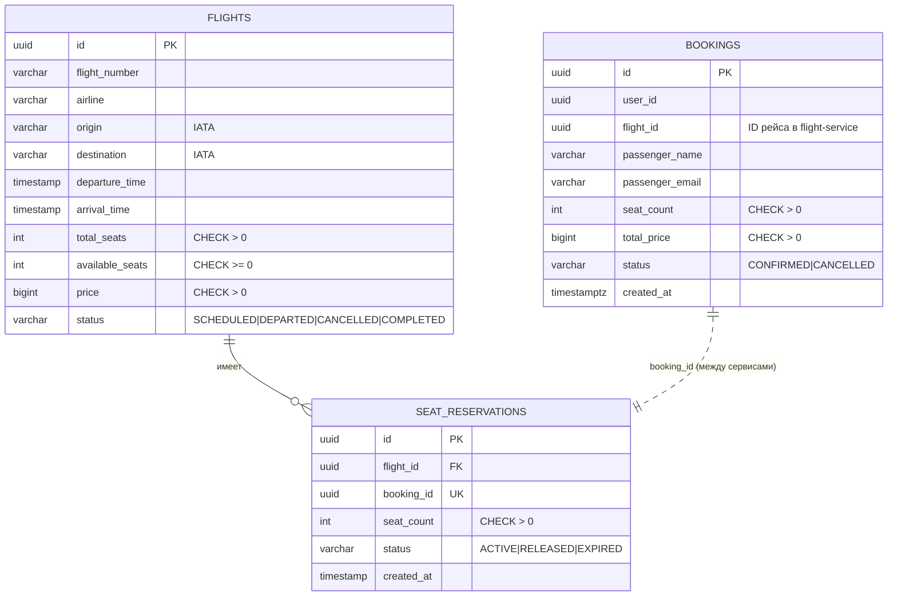

# Система бронирования авиабилетов (микросервисы на Go)

Распределённая система бронирования авиабилетов из двух микросервисов, взаимодействующих по **gRPC**, с независимыми базами **PostgreSQL**, кэшем **Redis Sentinel**, полным **CI/CD**-пайплайном и стеком наблюдаемости **Prometheus + Grafana + Alertmanager**.

Весь стек поднимается одной командой `docker compose up`.

> 🇨🇳 Инструкция по использованию на китайском — [`README.zh-CN.md`](./README.zh-CN.md)

> 📚 Инженерная документация проекта (на китайском) — в [`docs/`](./docs/README.md): [архитектура](./docs/architecture/), [конвенции](./docs/conventions/), [планы](./docs/plans/), [задачи](./docs/tasks/README.md), [база знаний](./docs/knowledge/), [runbooks](./docs/runbooks/), [отчёты](./docs/reports/).

---

## Содержание

- [Архитектура](#архитектура)
- [Технологии](#технологии)
- [Быстрый старт](#быстрый-старт)
- [REST API](#rest-api)
- [Модель данных](#модель-данных)
- [Ключевые механизмы](#ключевые-механизмы)
- [Наблюдаемость](#наблюдаемость)
- [SLI / SLO](#sli--slo)
- [Тестирование](#тестирование)
- [CI/CD](#cicd)
- [Структура проекта](#структура-проекта)

---

## Архитектура

```
Клиент (HTTP REST)
       │
       ▼
┌──────────────────┐   gRPC :50051   ┌──────────────────┐
│ booking-service  │ ───────────────▶│  flight-service  │
│  Echo, HTTP :8080│  retry + circuit│  gRPC-сервер     │
│                  │  breaker + auth │                  │
└────────┬─────────┘                 └────────┬─────────┘
         │                                    │
    PostgreSQL                           PostgreSQL
    (booking_db :5434)                   (flight_db :5433)
                                              │
                                    ┌─── Redis Sentinel ───┐
                                    │  master + replica    │
                                    │  + sentinel :26379   │
                                    └──────────────────────┘

Наблюдаемость: Prometheus :9090 → Grafana :3000, Alertmanager :9093
Экспортёры: postgres_exporter ×2, redis_exporter
```

**booking-service** — публичный REST API, хранит бронирования в своей БД, все операции с местами делегирует flight-service по gRPC.

**flight-service** — внутренний gRPC-сервис, владеет рейсами и резервированием мест, кэширует чтения в Redis. Наружу отдаёт только `/metrics`.

У каждого сервиса **своя** база данных, миграции применяются автоматически при старте.

---

## Технологии

| Слой | Технологии |
|---|---|
| Язык | Go 1.24 |
| Межсервисное взаимодействие | gRPC, Protocol Buffers (кодогенерация `protoc`) |
| HTTP | Echo |
| Хранилище | PostgreSQL 16 ×2, миграции при старте |
| Кэш | Redis 7 в режиме Sentinel (master + replica + sentinel) |
| Оркестрация | Docker Compose (12 контейнеров) |
| Метрики | Prometheus, promhttp, postgres_exporter, redis_exporter |
| Визуализация | Grafana (provisioning дашбордов из кода) |
| Алертинг | Prometheus alert rules + Alertmanager |
| Нагрузочное тестирование | k6 |
| Тесты | `go test` (unit), pytest (интеграционные + E2E) |
| CI | GitHub Actions |

---

## Быстрый старт

```bash
docker compose up --build -d            # поднять весь стек (12 контейнеров)
pip install -r tests/requirements.txt   # один раз
pytest tests/ -v                        # 16 тестов
docker compose down -v                  # остановить и очистить тома
```

Либо через Makefile: `make run` (сборка + запуск + ожидание готовности + тесты), `make stop`.

### Порты

| Порт | Сервис |
|---|---|
| 8080 | booking-service — REST API и `/metrics` |
| 50051 | flight-service — gRPC |
| 9091 | flight-service — `/metrics` |
| 9090 | Prometheus |
| 9093 | Alertmanager |
| 3000 | Grafana (анонимный вход как Viewer; `admin/admin` для редактирования) |
| 5433 / 5434 | flight-db / booking-db |

### Тестовые данные

Загружаются автоматически при инициализации БД:

| Рейс | Маршрут | Мест | Цена |
|---|---|---|---|
| SU1234 | SVO → LED | 180 | 15000 |
| SU5678 | SVO → LED | 120 | 12000 |
| DP402 | VKO → LED | 189 | 8000 |

---

## REST API

Базовый URL: `http://localhost:8080`

| Метод | Путь | Описание |
|---|---|---|
| GET | `/flights?origin=&destination=&date=` | Поиск рейсов по маршруту и дате |
| GET | `/flights/{id}` | Рейс по идентификатору |
| POST | `/bookings` | Создание бронирования |
| GET | `/bookings/{id}` | Бронирование по идентификатору |
| GET | `/bookings?user_id=` | Бронирования пользователя |
| POST | `/bookings/{id}/cancel` | Отмена бронирования и возврат мест |
| GET | `/metrics` | Метрики Prometheus |

### Создание бронирования

```bash
curl -X POST http://localhost:8080/bookings \
  -H "Content-Type: application/json" \
  -d '{
    "user_id": "550e8400-e29b-41d4-a716-446655440000",
    "flight_id": "a0eebc99-9c0b-4ef8-bb6d-6bb9bd380a11",
    "passenger_name": "Ivan Ivanov",
    "passenger_email": "ivan@example.com",
    "seat_count": 2
  }'
```

```json
{
  "id": "d4e5f6a7-...",
  "user_id": "550e8400-e29b-41d4-a716-446655440000",
  "flight_id": "a0eebc99-9c0b-4ef8-bb6d-6bb9bd380a11",
  "passenger_name": "Ivan Ivanov",
  "passenger_email": "ivan@example.com",
  "seat_count": 2,
  "total_price": 30000,
  "status": "CONFIRMED",
  "created_at": "2026-03-17T12:00:00Z"
}
```

Порядок обработки: `GetFlight` → `ReserveSeats` → фиксация цены на момент брони (`total_price = seat_count × price`) → запись со статусом `CONFIRMED`. Если резервирование мест не удалось, бронирование **не создаётся**.

| Код | Значение |
|---|---|
| 201 | Бронирование создано |
| 400 | Некорректные параметры запроса |
| 404 | Рейс или бронирование не найдены |
| 409 | Недостаточно мест / бронирование уже отменено |
| 503 | Circuit breaker разомкнут — flight-service недоступен |

### gRPC-контракт flight-service

`proto/flight/flight.proto` — методы `SearchFlights`, `GetFlight`, `ReserveSeats`, `ReleaseReservation`. Даты передаются как `google.protobuf.Timestamp`, статусы — `enum`, бизнес-ошибки отображаются на стандартные коды gRPC (`NOT_FOUND`, `RESOURCE_EXHAUSTED`, `UNAUTHENTICATED`, `INVALID_ARGUMENT`).

---

## Модель данных

Схема соответствует 3НФ, целостность обеспечивается ограничениями на уровне БД.



Ключевые ограничения: `available_seats >= 0`, `available_seats <= total_seats`, `total_seats > 0`, `price > 0`, уникальный индекс по паре «номер рейса + дата вылета», уникальный `booking_id` в резервированиях (основа идемпотентности).

---

## Ключевые механизмы

### Транзакционная целостность

В flight-service уменьшение `available_seats` и создание записи `seat_reservations` выполняются в **одной транзакции**; строка рейса блокируется через `SELECT ... FOR UPDATE`, что исключает гонку при бронировании последних мест. Возврат мест при отмене — так же атомарно. В booking-service запись бронирования создаётся только после успешного `ReserveSeats`, частично применённых состояний не возникает.

### Аутентификация между сервисами

API-ключ передаётся в метаданных gRPC (`x-api-key`) и проверяется unary-интерцептором на стороне flight-service для **всех** методов. Отсутствующий или неверный ключ → `UNAUTHENTICATED`. Ключ задаётся переменной окружения `AUTH_API_KEY`.

### Кэширование (Cache-Aside)

Redis-кэш в flight-service: `flight:{id}` и `search:{origin}:{destination}:{date}`, TTL 5 минут для всех ключей. Чтение: кэш → при промахе БД → запись в кэш. При изменении данных (`ReserveSeats`, `ReleaseReservation`) кэш рейса и связанных поисковых запросов инвалидируется явно. Попадания и промахи пишутся в лог (`[CACHE] HIT/MISS/SET`).

### Отказоустойчивость вызовов gRPC

- **Повторы**: до 3 попыток с экспоненциальной задержкой (100 → 200 → 400 мс) только для `UNAVAILABLE` и `DEADLINE_EXCEEDED`; `INVALID_ARGUMENT`, `NOT_FOUND`, `RESOURCE_EXHAUSTED` не повторяются.
- **Идемпотентность**: `ReserveSeats` с одним и тем же `booking_id` не создаёт дублирующее резервирование (уникальный ключ + проверка существующей записи), поэтому повторы безопасны.
- **Circuit breaker**: отдельный пакет, подключаемый как обёртка над gRPC-клиентом (вне бизнес-логики). Состояния `CLOSED → OPEN → HALF_OPEN`, переходы логируются, параметры задаются переменными окружения `CB_ERROR_THRESHOLD`, `CB_TIMEOUT_SECONDS`, `CB_WINDOW_SECONDS`. В состоянии OPEN клиент немедленно получает `503`, а не таймаут.
- **Redis Sentinel**: master + replica + sentinel, клиент подключается через Sentinel и переживает автоматический failover.

---

## Наблюдаемость

Оба сервиса экспортируют метрики в формате Prometheus:

| Метрика | Тип | Метки |
|---|---|---|
| `http_requests_total` | counter | service, endpoint, method, status |
| `http_request_errors_total` | counter | service, endpoint, error_type |
| `http_request_duration_seconds` | histogram | service, endpoint |
| `flight_cache_operations_total` | counter | cache, op, result |

Для HTTP в качестве метки endpoint используется шаблон маршрута (`/bookings/:id`), а не фактический URL — это ограничивает кардинальность; на стороне gRPC используется `info.FullMethod`.

Prometheus опрашивает 6 таргетов с интервалом 5 с: оба сервиса, оба postgres_exporter, redis_exporter и самого себя.

### Логи

Оба сервиса пишут structured JSON через `slog`. **Одна строка на запрос**: её печатает middleware (HTTP) или перехватчик (gRPC), а слои handler / service / клиент логгера не имеют вообще — то, что стоит записать, они складывают в контекстный набор полей, и он попадает в ту же строку. Обе строки одного вызова связаны общим `trace_id`, который передаётся через gRPC-метаданные `x-trace-id`.

Уровень определяется исходом, а не тем, «насколько страшно выглядит»: успех и **бизнес-отказ** (нет мест, не найдено) — `Info`; автоматически обработанная деградация (успех после ретрая, сбой записи в кэш) — `Warn`; 5xx и внутренние ошибки — `Error`.

| `LOG_LEVEL` | Когда | Что остаётся в логах |
|---|---|---|
| `info` (по умолчанию) | обычная работа | по одной строке на запрос в каждом сервисе |
| `warn` | нагрузочное тестирование | переходы circuit breaker, деградации, 5xx — путь запроса не пишется вообще |

```bash
LOG_LEVEL=warn docker compose up -d
```

Полные правила — в [`CLAUDE.md`](./CLAUDE.md) § 4, обоснование и список допустимых полей — в [`docs/conventions/engineering.md`](./docs/conventions/engineering.md) § 5.

### Дашборды Grafana

Загружаются автоматически через provisioning (`grafana/dashboards/`):

**Services** — RPS по сервисам, перцентили задержки p50/p95/p99, доля ошибок, распределение по кодам ответа.

**Infrastructure** — доступность экспортёров, активные соединения PostgreSQL по базам, скорость commit/rollback, попадание в буферный кэш, Redis ops/sec, память и подключённые клиенты, а также попадание в кэш приложения (`flight_cache_operations_total`) — при `LOG_LEVEL=warn` это единственный способ узнать, держится ли пропускная способность на кэше.

### Алерты

`prometheus/alerts.yml` + Alertmanager:

| Алерт | Условие | Severity |
|---|---|---|
| `HighErrorRate` | доля ошибок > 5% в течение 2 мин | critical |
| `HighLatencyP95` | p95 > 1 с в течение 2 мин | warning |
| `ServiceDown` | таргет недоступен более 1 мин | critical |

Демонстрация срабатывания: `./scripts/demo_alerts.sh service-down`, статус — `./scripts/demo_alerts.sh status` или UI на <http://localhost:9093>, восстановление — `./scripts/demo_alerts.sh restore`.

---

## SLI / SLO

Три показателя, вычисляемые из реальных метрик Prometheus и защищённые двумя рубежами: проверкой в CI и алертами.

| SLI | PromQL | SLO | Порог отказа |
|---|---|---|---|
| Доступность API | `1 - sum(rate(http_request_errors_total[5m])) / sum(rate(http_requests_total[5m]))` | > 99% | < 95% |
| Задержка p95 | `histogram_quantile(0.95, sum by (le) (rate(http_request_duration_seconds_bucket[5m])))` | < 500 мс | > 1000 мс |
| Живость сервисов | `up{job=~"booking-service\|flight-service"}` | = 1 | = 0 более 1 мин |

Обоснование порогов: базовая линия по нагрузочному тесту — 0 ошибок на 3700+ запросов и p95 около 5 мс, поэтому SLO задаёт запас, а порог отказа выбран так, чтобы не срабатывать на кратковременных всплесках.

Проверка вручную:

```bash
PROM_URL=http://localhost:9090 python3 scripts/verify_metrics.py   # exit 1 при нарушении
cat metrics-report.json
```

---

## Тестирование

```bash
pytest tests/ -v     # 16 тестов
```

| Группа | Тестов | Что проверяется |
|---|---|---|
| Поиск рейсов | 5 | поиск с датой и без, разные маршруты, получение по id, 404 |
| Создание брони | 4 | успешный сценарий, списание мест, 409 при нехватке мест, 404 по рейсу |
| Чтение броней | 3 | по id, список пользователя, 404 |
| Отмена | 3 | успешная отмена, повторная отмена (409), возврат мест |
| E2E с проверкой БД | 1 | прямое подключение к обеим PostgreSQL: строка `bookings`, строка `seat_reservations` и значение `available_seats` на всём цикле create → cancel |

Дополнительно — unit-тесты Go (`go test -race`) для circuit breaker и gRPC-хендлеров.

### Нагрузочный тест

`k6/script.js` — три сценария, выбираются переменными `SCENARIO` и `MODE`:

| `SCENARIO` | Нагрузка на что | Режим | На какой вопрос отвечает |
|---|---|---|---|
| `steady` | много рейсов, чтение/запись 20:1 | постоянные 500 RPS | выполняются ли `p95` и доля ошибок в штатном режиме |
| `read` | 50 рейсов, только `GET /flights/{id}` | `recon` / `ladder` | предел пропускной способности чтения |
| `write` | **один** рейс, только `POST /bookings` | `recon` / `ladder` | предел построчной блокировки и поведение при перегрузке |

```bash
make loadtest-seed          # залить рейсы для нагрузочного теста (не в миграциях — это тестовая оснастка)
make loadtest-steady        # штатный режим: 500 RPS, пороги p95 < 50 мс, ошибки < 1%
```

Поиск точки перегиба идёт в два прохода — **сначала замкнутый контур, потом разомкнутый**:

```bash
make loadtest-write-recon                 # наращиваем VU, читаем плато пропускной способности X_max
make loadtest-write-ladder RATE_MAX=654   # разомкнутый контур: лестница 0.5×–1.5× от X_max
```

В замкнутом контуре `VU = пропускная способность × задержка` — тождество: после насыщения задержка растёт строго линейно по числу VU, поэтому нелинейную деградацию при перегрузке видно только в разомкнутом. Кривая по ступеням печатается в терминал сразу после прогона, с указанием точки перегиба; те же данные сохраняются в `k6/out/<run>.report.json` (несколько КБ). CSV не пишется: строки идут по сэмплам метрик, а не по запросам, — один прогон на чтение дал бы 8.4 ГБ.

409 исключён из `http_req_failed` (`k6/script.js:53`): нехватка мест — штатный бизнес-отказ, а не сбой.

**k6 в CI — не гейт по ёмкости**: runner на порядок слабее машины разработчика. В CI гоняется только дымовой `steady`. Выводы по ёмкости — только с локальной машины, в `docs/reports/load/` с указанием конфигурации железа.

---

## CI/CD

GitHub Actions, `.github/workflows/ci.yml`, запускается на push в `main` и на каждый pull request.

| Job | Что делает |
|---|---|
| `build` | сборка обоих сервисов (`go build ./...`) |
| `unit` | `go test -race -count=1 ./...` |
| `integration` | поднимает весь стек в docker compose, ждёт готовности по `/metrics`, проверяет через API Prometheus, что таргеты действительно `up`, прогоняет pytest, выгружает логи контейнеров как артефакт |
| `load-test` | поднимает стек, запускает k6, печатает сводку, затем `scripts/verify_metrics.py` проверяет SLI-пороги запросами в Prometheus и падает при нарушении; сводка k6 и `metrics-report.json` сохраняются как артефакты |

Таким образом пайплайн блокирует мёрж не только при падении тестов, но и при деградации задержек или роста ошибок под нагрузкой.

---

## Структура проекта

```
.
├── proto/flight/flight.proto     # gRPC-контракт
├── docker-compose.yml            # 12 контейнеров
├── Makefile
│
├── flight-service/               # gRPC-сервис
│   ├── cmd/main.go
│   ├── internal/
│   │   ├── handler/              # gRPC-хендлеры
│   │   ├── service/              # бизнес-логика + кэш
│   │   ├── repository/           # SQL, транзакции, SELECT FOR UPDATE
│   │   ├── auth/                 # интерцептор аутентификации
│   │   ├── cache/                # Redis Cache-Aside
│   │   └── metrics/              # метрики Prometheus
│   ├── pb/flight/                # сгенерированный код
│   └── migrations/
│
├── booking-service/              # REST-сервис
│   ├── cmd/main.go
│   └── internal/
│       ├── handler/ service/ repository/
│       ├── grpcclient/           # клиент + повторы + circuit breaker
│       ├── circuitbreaker/       # конечный автомат CLOSED/OPEN/HALF_OPEN
│       └── metrics/
│
├── prometheus/                   # конфигурация scrape + правила алертов
├── alertmanager/
├── grafana/                      # provisioning + дашборды как код
├── k6/                           # нагрузочные сценарии, seed-оснастка, разбор лестницы
├── scripts/                      # verify_metrics.py, demo_alerts.sh
└── tests/                        # pytest: интеграционные + E2E
```
