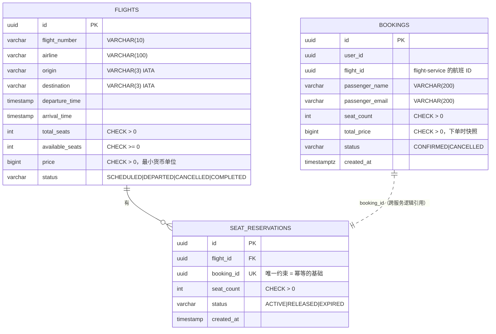

# 数据模型

> 描述 **迁移文件里实际存在的 schema**。改了迁移就要改这里。
>
> 源文件：[`flight-service/migrations/001_init.up.sql`](../../flight-service/migrations/001_init.up.sql)、[`booking-service/migrations/001_init.up.sql`](../../booking-service/migrations/001_init.up.sql)

## 分库边界

两个服务各持有独立数据库，**没有跨库外键**。

| 库 | 端口 | 表 | 所有权 |
|---|---|---|---|
| `flight_db` | 5433 | `flights`、`seat_reservations` | flight-service —— 座位库存的唯一所有权方 |
| `booking_db` | 5434 | `bookings` | booking-service —— 订单的唯一所有权方 |

`bookings.flight_id` 和 `seat_reservations.booking_id` 是**逻辑引用**，数据库层面无法保证。这个选择的代价是跨库一致性缺口，见 [D-06](../tasks/D-06-seat-inventory-leak.md)。

## ER 图

## 完整性约束

约束写在数据库层，不只在应用层。**即使业务代码写错，数据库也不接受负库存。**

### flights

| 约束 | 定义 | 防什么 |
|---|---|---|
| `CHECK (total_seats > 0)` | 列约束 | 无意义的空航班 |
| `CHECK (available_seats >= 0)` | 列约束 | **超卖** —— 应用层扣减逻辑出错时的最后一道防线 |
| `CHECK (price > 0)` | 列约束 | 零价或负价航班 |
| `chk_available_le_total` | `available_seats <= total_seats` | 释放逻辑重复执行导致余位超过总座位 |
| `chk_status` | 枚举取值白名单 | 状态字段写入非法值 |
| `uq_flight_number_date` | `UNIQUE (flight_number, CAST(departure_time AS date))` | 同一航班号同一天重复录入 —— 这是业务上"一个具体航班"的自然键 |

### seat_reservations

| 约束 | 定义 | 防什么 |
|---|---|---|
| `booking_id UNIQUE` | 列约束 | **一个订单对应且只对应一条预留** —— 这是 gRPC 重试安全的前提 |
| `flight_id REFERENCES flights(id)` | 外键 | 预留指向不存在的航班 |
| `CHECK (seat_count > 0)` | 列约束 | 零座位预留 |
| `chk_reservation_status` | 枚举白名单 | 非法状态 |

### bookings

| 约束 | 定义 | 防什么 |
|---|---|---|
| `CHECK (seat_count > 0)` / `CHECK (total_price > 0)` | 列约束 | 无效订单 |
| `chk_booking_status` | `CONFIRMED|CANCELLED` | 非法状态 |

## 索引

| 索引 | 表 | 支撑什么查询 |
|---|---|---|
| `uq_flight_number_date` | flights | 唯一性约束（同时可被查询利用） |
| `idx_flights_route_date` | flights | `SearchFlights` 的 `origin + destination + 日期` 过滤 |
| `idx_reservations_booking` | seat_reservations | `ReleaseReservation` 按 `booking_id` 反查活跃预留 |
| `idx_bookings_user` | bookings | `GET /bookings?user_id=X` |

## 范式与两个有意的设计选择

schema 符合 3NF：没有传递依赖，没有部分依赖，每个非主属性都直接依赖主键。

有两处**看起来像冗余、实际不是**的地方，值得单独说明：

**1. `bookings.total_price` 不是 `seat_count × flights.price` 的冗余**

它是**下单时刻的价格快照**。航班改价后，已有订单的金额不能跟着变。函数依赖的左边是"订单"，不是"航班当前价格"，所以这不违反 3NF。

写入位置：[`booking-service/internal/service/booking.go`](../../booking-service/internal/service/booking.go) 的 `CreateBooking`。

**2. `flights.available_seats` 不是 `total_seats - SUM(活跃预留座位数)` 的冗余**

理论上它可以每次聚合算出来。这里物化成一列，是为了让扣减能在**单行上加锁**（`SELECT ... FOR UPDATE`）—— 聚合查询无法提供针对"这个航班的库存"这一逻辑资源的互斥。

代价是这一列必须和 `seat_reservations` 保持一致，而这个一致性完全由应用层的事务保证。数据库只能用 `CHECK` 兜住范围，兜不住"数值是否正确"。

并发控制的具体实现见 [overview.md](./overview.md)。

## 价格单位

`price` 和 `total_price` 都是 `BIGINT`，存**最小货币单位**（戈比 / 分），不用浮点。

避免浮点数在金额计算上的精度问题 —— 这是金融类数据建模的通用做法，不是这个项目特有的。
